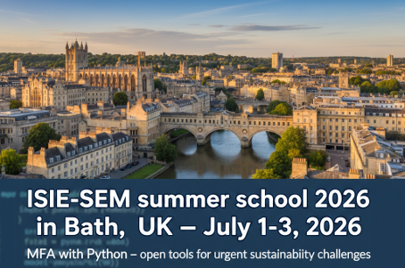

# ISIE-SEM Summer School 2026



This repository contains teaching materials for the **ISIE-SEM Summer School 2026**, a 3-day summer school for doctoral students and advanced master students at the University of Bath.

The summer school is an official side event of the **ISIE-SEM Conference** in Cambridge, UK, held on **July 6–8, 2026**.

## About

The summer school offers hands-on training in building, solving, and analysing **dynamic material flow analysis (dMFA)** systems with Python.

Participants first work through three common modules, each lasting about half a day:

1. **dMFA in Python — basics**
2. **Uncertainty and Monte Carlo simulation**
3. **Managing Python projects and packages with [uv](https://docs.astral.sh/uv/)**

In the second half of the summer school, participants branch into focus groups of up to 15–18 participants.

## Focus Groups

| Teacher | Institution | Focus |
| --- | --- | --- |
| Rick Lupton | University of Bath, UK | Uncertainty propagation and Markov chain Monte Carlo simulations in dynamic MFA models with Python |
| Zhi Cao | Nankai University, China | Linking dynamic MFA to the Python-based TEMOA energy-system model, showing how material stocks, flows, and emissions influence scenario-based energy pathways and technology choices |
| Stefan Pauliuk | University of Freiburg, Germany | Vehicle fleet modelling of the stock-flow-service nexus using the new [flodym](https://flodym.readthedocs.io/) package, from transport demand to GHG and material footprints, including inflow-driven and stock-driven fleet models |

## Repository Structure

```text
├── 1_dMFA_Python_Intro_Stefan_Pauliuk/
│   ├── Jupyter notebooks
│   ├── sample solutions
│   └── Bath_dMFA_Python_SummerSchool_2026.pdf
├── 2_focus_groups/
│   ├── 21_Monte-Carlo_Rick_Lupton/
│   ├── 22_GloBus-Temoa_Zhi_Cao/
│   │   ├── docs/
│   │   ├── GloBus/
│   │   └── TEMOA/
│   └── 23_flodym_deepdive_Stefan_Pauliuk/
│       ├── input_data/
│       ├── pictures/
│       └── Jupyter notebooks
└── asset/
    ├── env/
    └── pic/

```

## Getting Started

Course participants can begin with the numbered folders in order:

1. Make sure you have a Python environment/installation following
   [`python-setup-guide.md`](python-setup-guide.md)
2. Open the introductory dMFA notebooks in `1_dMFA_Python_Intro_Stefan_Pauliuk/`.
3. Choose the relevant focus group materials in `2_focus_groups/`.
4. For the uncertainty focus group, start with `2_focus_groups/21_Monte-Carlo_Rick_Lupton/README.md`.
4. For the GloBus-Temoa focus group, start with `2_focus_groups/22_GloBus-Temoa_Zhi_Cao/README.md`.
5. For the flodym deep dive, use `2_focus_groups/23_flodym_deepdive_Stefan_Pauliuk/`.

## Organizers

- Rick Lupton, University of Bath, UK
- Zhi Cao, Nankai University, China
- Stefan Pauliuk, University of Freiburg, Germany

## Licence

This work is licensed under [CC BY 4.0](https://creativecommons.org/licenses/by/4.0/)
